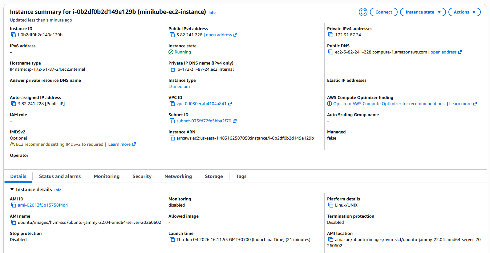
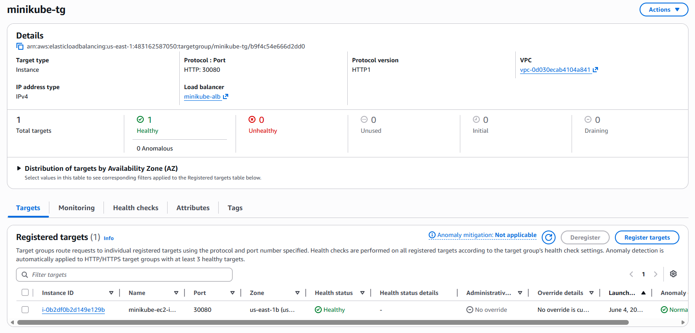
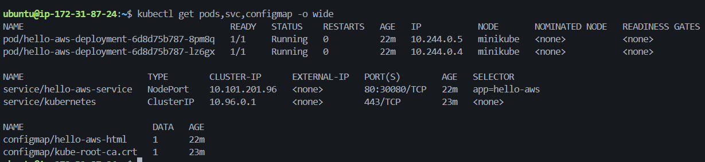
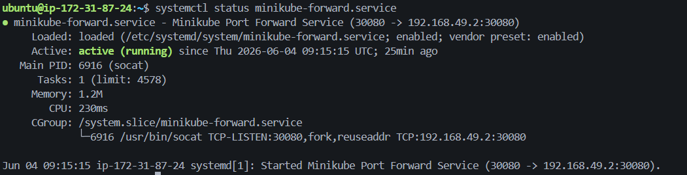
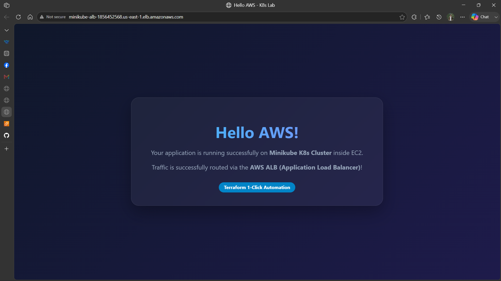

# LAB REPORT: K8S ON AWS - TERRAFORM 1-CLICK DEPLOYMENT

---

## STUDENT METADATA
*   **Student ID**: XB-DN26-064
*   **Course**: AWS & Kubernetes Cloud Infrastructure Laboratory
*   **Date**: 2026-06-04
*   **Status**: Completed & Verified
*   **Target Region**: us-east-1 (N. Virginia)

---

## 1. INFRASTRUCTURE OVERVIEW

The deployed architecture utilizes a simplified 1-Click Terraform deployment using the AWS Default VPC. It registers an EC2 instance hosting a Minikube cluster and exposes the containerized web application to the public internet via an AWS Application Load Balancer (ALB).

### System Parameters Table

| Parameter | Configuration Value |
| :--- | :--- |
| AWS Region | us-east-1 |
| VPC Type | AWS Default VPC |
| EC2 Instance Type | t3.medium (2 vCPUs, 4GB RAM, 30GB gp3 EBS) |
| EC2 Public IP | 3.82.241.228 |
| ALB Public DNS Name | http://minikube-alb-1856452568.us-east-1.elb.amazonaws.com |
| Kubernetes Distro | Minikube v1.38.1 (Docker Driver) |
| Containerized App Replicas | 2 Pods (Nginx Web Server) |
| Target Port mapping | ALB (80) -> EC2 Target Group (30080) -> Socat -> Minikube NodePort (30080) -> Pod (80) |

---

## 2. VERIFICATION CHECKS AND EVIDENCE COLLECTION

Below are the verified screenshots confirming the successful execution of each stage.

### Check 1: EC2 Instance Status on AWS Console
*   **Description**: Verification of the active EC2 instance running Minikube.


### Check 2: Application Load Balancer (ALB) Status on AWS Console
*   **Description**: Verification of the active Application Load Balancer distributing public traffic.


### Check 3: Target Group Health Checks
*   **Description**: Verification showing the EC2 target registered on port 30080 passing the HTTP health check successfully.


### Check 4: Kubernetes Resources via SSH Terminal
*   **Description**: Verification of 2 Pods of hello-aws-deployment running successfully and hello-aws-service mapped to NodePort 30080.


### Check 5: Socat Port Forwarding Service
*   **Description**: Verification showing the minikube-forward systemd daemon status is active and forwarding traffic.


### Check 6: Web Application Frontend Access
*   **Description**: Verification showing the custom Nginx landing page accessed publicly via the ALB DNS.


---

## 3. TECHNICAL CONCLUSION AND ANALYSIS

1.  **Multiple Provider Integration**: The system successfully integrated the `aws` provider (infrastructure provisioning), the `tls` provider (cryptographic SSH key generation), the `cloudinit` provider (bootstrap user data preparation), and the `local` provider (local PEM file export). Output credentials from the `tls` provider were successfully wired as inputs to the `aws_key_pair` resource.
2.  **Traffic Routing Bridge**: As Minikube runs inside a Docker container with an isolated network bridge, port-forwarding via `socat` proved to be a highly lightweight and stable mechanism to bridge the host port `30080` to the internal Minikube IP.
3.  **High Availability (HA)**: By specifying 2 replicas in the Deployment manifest, the application leverages K8s replica sets to provide pod-level failover. The ALB further maps requests across public availability zones in the region.

---

## 4. VERIFICATION COMMANDS REFERENCE

The following commands were executed to perform the technical verification of the lab infrastructure.

### 4.1. Remote Connection (Executed on Local Administrator Host)
Used to securely connect to the EC2 instance using the dynamically generated SSH private key:
```bash
ssh -i minikube-key.pem ubuntu@3.82.241.228
```

### 4.2. Bootstrap Log Auditing (Executed inside EC2)
Used to audit the cloud-init logs and verify the successful completion of the bootstrap installation script:
```bash
cat /var/log/user_data_setup.log
```

### 4.3. Kubernetes State Verification (Executed inside EC2)
Used to confirm the operational state of the Kubernetes pods, services, and configuration maps:
```bash
kubectl get pods,svc,configmap -o wide
```

### 4.4. Port Forwarding Daemon Status (Executed inside EC2)
Used to verify that the `socat` port forwarding service is running active under systemd:
```bash
systemctl status minikube-forward.service
```

### 4.5. Local Web Server Verification (Executed inside EC2)
Used to test if the host port `30080` successfully proxies traffic into the K8s cluster:
```bash
curl -I http://localhost:30080
```

### 4.6. Public Frontend Verification (Executed on Local Administrator Host)
Used to verify the Application Load Balancer (ALB) external routing and public domain access:
```bash
curl -I http://minikube-alb-1856452568.us-east-1.elb.amazonaws.com
```
