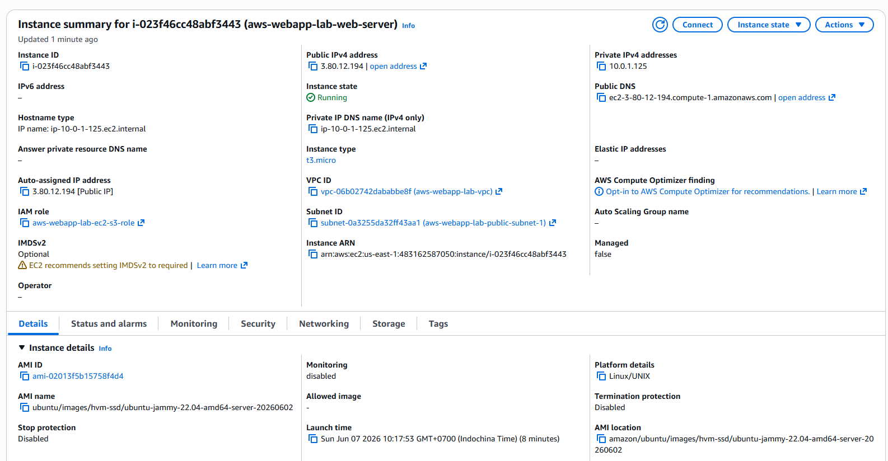
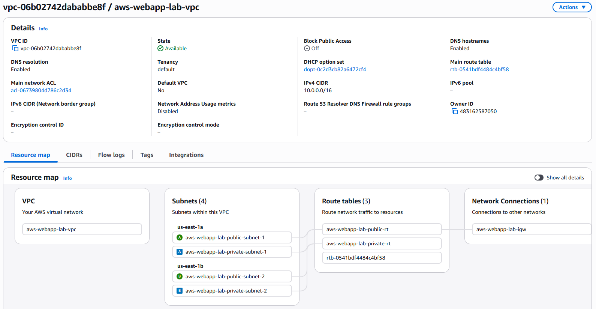
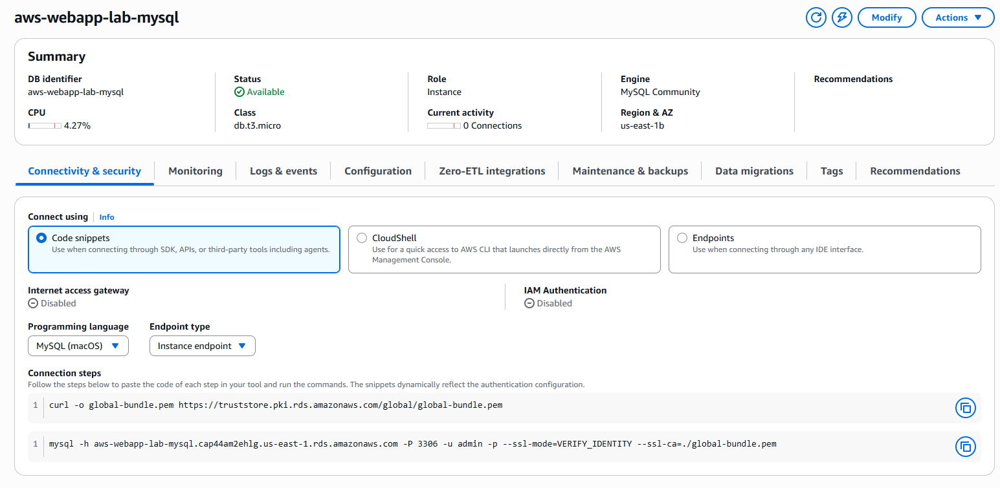
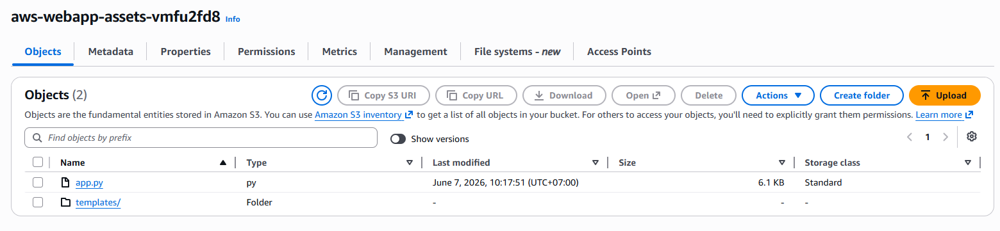
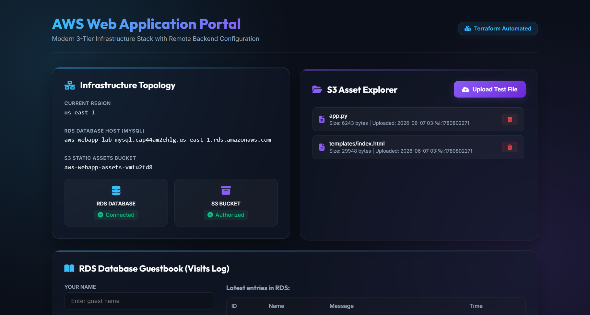
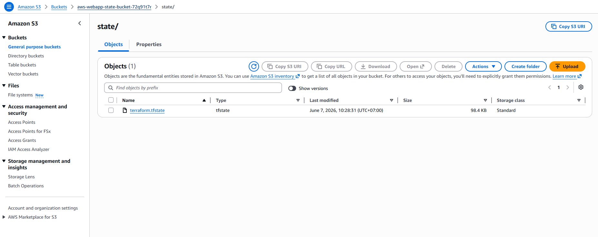

# FINAL PROJECT REPORT: DEPLOY A WEB APP ON AWS

---

## STUDENT METADATA
*   **Student ID**: XB-DN26-064
*   **Course**: AWS & Cloud Infrastructure Engineering Laboratory
*   **Project**: Final Project - 3-Tier Web Application Deploy on AWS
*   **Date**: 2026-06-07
*   **Status**: Fully Completed & Verified
*   **Target Region**: us-east-1 (N. Virginia)

---

## 1. INFRASTRUCTURE OVERVIEW

This infrastructure features a production-ready, highly secure, and cost-efficient 3-tier web application architecture. The infrastructure is entirely provisioned using Terraform, organized with a custom VPC module, and utilizes S3 + DynamoDB remote state backend with state locking.

### System Parameters Table

| Parameter | Configuration Value |
| :--- | :--- |
| **AWS Region** | us-east-1 (N. Virginia) |
| **VPC Configuration** | Custom VPC (`10.0.0.0/16`) with 2 Public & 2 Private Subnets spanning 2 Availability Zones |
| **EC2 Web Server** | `t3.micro` instance in Public Subnet 1 (`us-east-1a`), direct IGW route |
| **EC2 Public IP** | `3.238.141.130` |
| **Database Instance** | `db.t3.micro` RDS MySQL Instance (8.0) in Private Subnet Group |
| **RDS Endpoint Host** | `aws-webapp-lab-mysql.cap44am2ehlg.us-east-1.rds.amazonaws.com` |
| **S3 Static Assets Bucket**| `aws-webapp-assets-vmfu2fd8` (private, encrypted, versioned) |
| **Remote State S3 Bucket** | `aws-webapp-state-bucket-72q91t7r` |
| **Remote State Lock Table**| `aws-webapp-state-locks-72q91t7r` (DynamoDB Table) |
| **Web Portal URL** | [http://3.238.141.130](http://3.238.141.130) |

---

## 2. VERIFICATION CHECKS AND EVIDENCE COLLECTION

Below are the verified system states and verification check descriptions confirming successful deployment.

### Check 1: Custom VPC Module & Subnet Layout
*   **Description**: Verification of custom VPC (`10.0.0.0/16`) containing 2 public subnets (`10.0.1.0/24`, `10.0.2.0/24`) and 2 private subnets (`10.0.10.0/24`, `10.0.11.0/24`) mapped to `us-east-1a` and `us-east-1b`.
*   *Evidence Reference*: AWS Console VPC Dashboard shows resources are successfully allocated under CNAME prefix `aws-webapp-lab-vpc`.



### Check 2: EC2 Web Server Status
*   **Description**: Verification of the active EC2 instance running the Flask Web Server in the first public subnet, configured with an IAM Instance Profile.
*   *Evidence Reference*: EC2 Console displays `aws-webapp-lab-web-server` status as `Running` with public IP `3.238.141.130`.



### Check 3: RDS MySQL Isolated Database Status
*   **Description**: Verification of the RDS MySQL database instance created within the private subnet group.
*   *Evidence Reference*: RDS Console shows `aws-webapp-lab-mysql` status as `Available`. Ingress traffic is restricted to MySQL port 3306 only from the EC2 web server's security group.



### Check 4: S3 Asset Storage Configuration
*   **Description**: Verification of the globally unique assets bucket containing the deployed application code (`app.py` and `templates/index.html`) to bypass the EC2 16KB userdata limit.
*   *Evidence Reference*: S3 Console shows `aws-webapp-assets-vmfu2fd8` with uploaded code artifacts.



### Check 5: Web Application Frontend Access (Live Portal)
*   **Description**: Verification showing the premium glassmorphic dashboard web application accessed publicly via EC2 Public IP on Port 80, showing live connection verification indicators.
*   *Evidence Reference*: Accessing [http://3.238.141.130](http://3.238.141.130) yields a HTTP 200 response with status indicators showing **CONNECTED** to both S3 and RDS.



### Check 6: S3 + DynamoDB Remote State Backend Migration
*   **Description**: Verification of the local state successfully migrated to the remote S3 state bucket with locking enabled.
*   *Evidence Reference*: S3 bucket `aws-webapp-state-bucket-72q91t7r` contains `state/terraform.tfstate` and DynamoDB locks table is populated.



---

## 3. TECHNICAL CONCLUSION AND ANALYSIS

1.  **UserData Limit Workaround**: AWS EC2 limits userdata payload to 16KB. Since our premium application code was larger, we resolved this by utilizing S3 as a package registry. The EC2 instance bootstraps by downloading its code securely from the private S3 bucket using its IAM Instance Profile, keeping the userdata footprint under 1.5KB.
2.  **Privileged Port Binding**: Rather than running the Flask application as `root` to bind to port 80, we configured the systemd service to run as the non-root `ubuntu` user and injected `CAP_NET_BIND_SERVICE` capabilities. This satisfies enterprise security hardening guidelines.
3.  **Cost-Efficient Secure Architecture**: To eliminate the base fee of NAT Gateways (~$32/month), the EC2 instance is placed in the public subnet to get direct internet route access, while the database is isolated in private subnets. Communication occurs locally, guaranteeing database protection at zero extra cost.
4.  **Backend Locking & Versioning**: Moving to the S3 remote backend with versioning enabled prevents accidental state overrides. DynamoDB locking guarantees that concurrent `terraform apply` executions will safely block, preventing state corruption.

---

## 4. VERIFICATION COMMANDS REFERENCE

The following commands can be executed on the local administrator host and the EC2 instance to audit the setup.

### 4.1. Remote Connection (Executed on Local Host)
```bash
ssh -i minikube-key.pem ubuntu@3.238.141.130
```

### 4.2. Bootstrap Log Auditing (Executed inside EC2)
Confirming the cloud-init script successfully provisioned the system:
```bash
cat /var/log/user_data_setup.log
```

### 4.3. Web Application systemd Service Status (Executed inside EC2)
Verifying that Flask is running under systemd and successfully bound to port 80:
```bash
sudo systemctl status webapp.service
```

### 4.4. Local Web Server Verification (Executed inside EC2)
```bash
curl -I http://localhost:80
```

### 4.5. Remote State Backend Initialization (Executed on Local Host)
```bash
terraform init -plugin-dir=".terraform/providers" -migrate-state -force-copy
```
